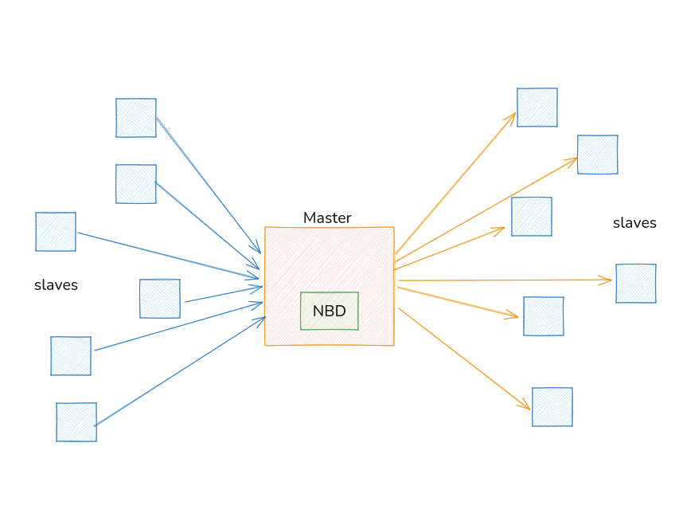

# Netspace

This project involves designing a system to store an enterprise’s intellectual property on a private cloud composed of unused storage from IoT devices within the organization’s network. The architecture consists of a master machine and multiple slave programs running on each IoT device. Data is transmitted from the slaves to the master, which manages distribution across the available storage nodes using the NBD (Network Block Device) protocol.

Future extensions may include implementing RAID configurations for redundancy and performance, as well as developing custom networking protocols to optimize data transfer and reliability.

made with C/C++ using all best practices including OOP, OOD, SOLID, Design Patterns.

